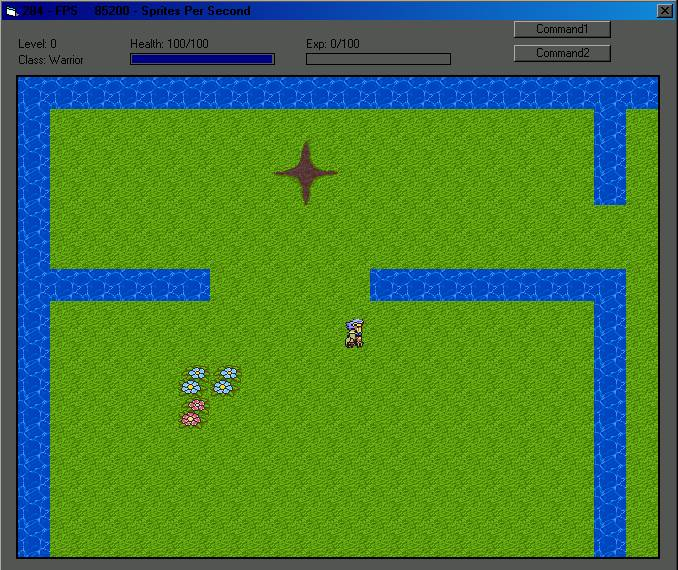



## Update \-\- RPG Engine \(DX\)

### Description

Update to my engine -

-Now uses time based modeling, no more need to limit FPS, same move speed on any computer still.

-Supports more detailed maps

-Much more for managing charactors

-Interface started

-More. =)
 
### More Info
 

             |
---                |---
**Submitted On**   |2002-05-10 16:36:08
**By**             |[Matt P Claiborne](https://github.com/Planet-Source-Code/PSCIndex/blob/master/ByAuthor/matt-p-claiborne.md)
**Level**          |Advanced
**User Rating**    |4.4 (35 globes from 8 users)
**Compatibility**  |VB 5\.0, VB 6\.0
**Category**       |[DirectX](https://github.com/Planet-Source-Code/PSCIndex/blob/master/ByCategory/directx__1-44.md)
**World**          |[Visual Basic](https://github.com/Planet-Source-Code/PSCIndex/blob/master/ByWorld/visual-basic.md)
**Archive File**   |[Update\_\-\-\_817755102002\.zip](https://github.com/Planet-Source-Code/matt-p-claiborne-update-rpg-engine-dx__1-34659/archive/master.zip)

